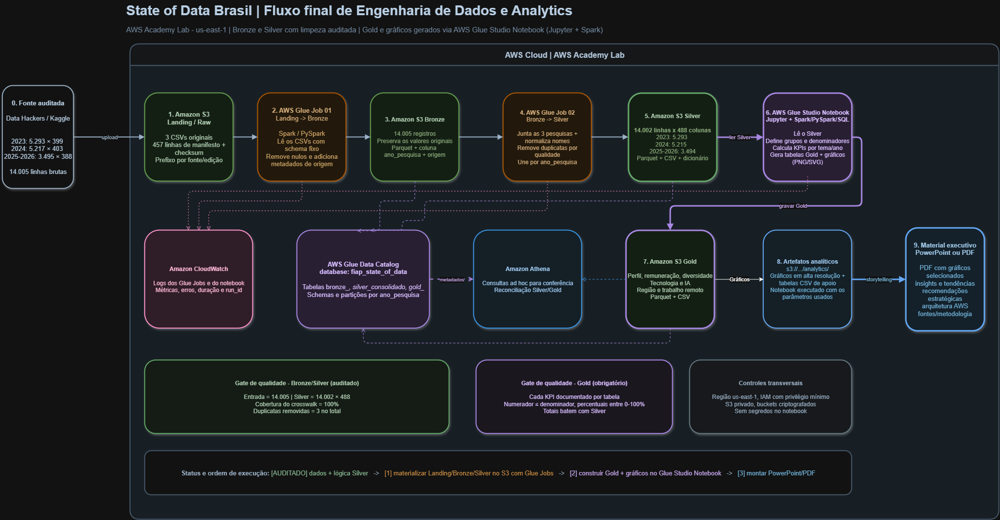

# Indicadores Gold — State of Data Brasil

Repositório da Fase 3, com os artefatos analíticos da pesquisa **State of Data Brasil**.
O projeto tem duas partes relacionadas:

- **Pipeline na AWS:** organização dos dados no Amazon S3 nas camadas Bronze,
  Silver e Gold, processamento com AWS Glue e consultas/validações no Athena.
- **Reprodução local:** recálculo dos indicadores a partir de um export da base
  preparada na AWS, usando PySpark para o processamento e Pillow para gerar os
  PNGs.

Os scripts locais em `codigo/` reproduzem as análises a partir do snapshot
autorizado. As cópias dos scripts executados no Glue e os artefatos de
tratamento usados pelo grupo ficam preservados, respectivamente, em
`aws_pipeline/` e `tratamento_dados/`. A execução local não consulta a AWS em
tempo real nem altera a infraestrutura.

## Arquitetura



```text
Arquivos das edições
        │
        ▼
S3 / Bronze ── AWS Glue ──> S3 / Silver ── AWS Glue ──> S3 / Gold
                              │                         │
                              └─ export da base        ├─ Athena / Glue Catalog
                                                       └─ validação dos produtos
                                                               │
                                                               ▼
                              PySpark local ── 9 análises ── Pillow ── PNGs/HTML
```

As capturas que documentam essa execução ficam em `AWS/`:

| Arquivo | Conteúdo |
|---|---|
| `arquitetura-aws.png` | Diagrama do fluxo completo |
| `S3-Bucket.png` | Bucket e prefixos Bronze, Silver e Gold |
| `S3-Bronze.png` | Arquivos de entrada das edições |
| `S3-Silver.png` | Produtos Silver, controle de qualidade e dicionário |
| `S3-Gold.png` | Produtos analíticos Gold e pasta de gráficos |
| `Glue.png` | Jobs Glue de processamento |
| `Athena.png` | Catálogo e consulta de validação |

## Tratamento e scripts do pipeline

Os artefatos que explicam a preparação da base estão separados do código dos
gráficos:

- `tratamento_dados/01_pipeline_tratamento_consolidacao.ipynb`: notebook
  PySpark/Colab com profiling, validação, limpeza, padronização e consolidação
  das três edições;
- `tratamento_dados/02_crosswalk_manual.csv`: crosswalk manual com 457 linhas,
  usado para alinhar os cabeçalhos equivalentes entre 2023, 2024 e 2025–2026;
- `aws_pipeline/`: scripts e exports dos jobs AWS Glue, organizados por etapa
  Bronze, Silver, Gold e publicação dos gráficos.

O notebook documenta o tratamento original do grupo. Já a execução local
documentada abaixo parte do export autorizado em `dados/` para que os gráficos
possam ser reproduzidos sem credenciais AWS.

## Dados e regra de leitura

A execução local usa o snapshot autorizado:

```text
dados/state_of_data_gold_export.csv
```

Esse arquivo está em nível de respondente e serve como entrada para a
reprodução local; não é uma tabela Gold agregada nem uma consulta ao vivo.
O Spark valida as colunas-chave, remove duplicidades por
`ano_pesquisa + id_resposta`, padroniza categorias e calcula as métricas.
Um novo export autorizado pode substituir o arquivo para atualizar as saídas.

Fonte pública da pesquisa: [Data Hackers no Kaggle](https://www.kaggle.com/datahackers/datasets).

| Valor em `ano_pesquisa` | Edição apresentada | Situação |
|---|---|---|
| `2023` | 2023–2024 | Encerrada |
| `2024` | 2024–2025 | Encerrada |
| `2025` | 2025–2026 | Coleta parcial |

O retrato atual contém **14.002 respostas únicas**. O gráfico de respondentes
mostra o volume acumulado observado. Nos demais recortes, os resultados são
apresentados em percentual dentro de cada edição quando o tamanho da amostra
puder distorcer a comparação. Portanto, 2025–2026 não deve ser comparada por
volume bruto com as edições encerradas.

## Indicadores gerados

Os PNGs e o relatório navegável ficam em `saidas/`:

| Arquivo | Indicador |
|---|---|
| `01_respondentes_por_ano.png` | Respondentes acumulados por edição |
| `02_funcoes_e_niveis.png` | Funções e níveis profissionais |
| `03_faixa_salarial_por_nivel.png` | Faixa salarial por nível |
| `04_perfil_regional.png` | Perfil regional |
| `05_diversidade_genero_senioridade.png` | Diversidade de gênero por senioridade |
| `06_tecnologias_principais.png` | Tecnologias mais citadas |
| `07_adocao_prioridade_ia.png` | Adoção e prioridade de IA |
| `08_motivos_nao_ia_resultados_llm.png` | Barreiras ao uso de IA e resultados com LLMs |
| `09_modelo_trabalho.png` | Modelo de trabalho: perguntas distintas por edição |

Também são gerados `00_previa_tres_anos.png`, `index.html` e `LEIA-ME.txt`.

## Execução local

Na raiz desta pasta, com o export salvo em `dados/`:

```powershell
python -m pip install -r requirements.txt
python gerar_todos.py
```

Depois, abra `saidas/index.html` no navegador. Para executar somente um
indicador, use o módulo correspondente, por exemplo:

```powershell
python -m codigo.grafico_06_tecnologias_principais
```

O código compartilhado está em `codigo/spark_comum.py` e `codigo/comum.py`;
os nove módulos `codigo/grafico_*.py` implementam as análises individuais.

## Estrutura principal

```text
AWS/                    evidências visuais da execução AWS
aws_pipeline/           scripts e exports dos jobs AWS Glue por etapa
codigo/                 processamento Spark e módulos dos gráficos
dados/                  export de entrada e documentação da base
tratamento_dados/       notebook e crosswalk do tratamento original
saidas/                 PNGs, HTML e relatório local
docs/                   mapa da entrega e auditoria
gerar_todos.py          execução consolidada
requirements.txt        dependências Python
```

Credenciais, chaves, tokens e permissões IAM não fazem parte do repositório.
As capturas servem como evidência do estado dos recursos no momento da
execução e não concedem acesso à AWS.

## Integrantes

| Nome | RM | E-mail |
|---|---|---|
| Felipe Macedo da Silva | RM373436 | felipemsdocs@gmail.com |
| João Pedro Mezzadri Mottin | RM372545 | joaopedromm.construtiva@outlook.com |
| Miguel Fernandes Martins de Bastos | RM373815 | miguelbastospro@gmail.com |
| Thanael Butewicz | RM373935 | zthanaelbutewicz@hotmail.com |
| Veronica de Fatima Machado Silva | RM371976 | v.machado10@hotmail.com |
